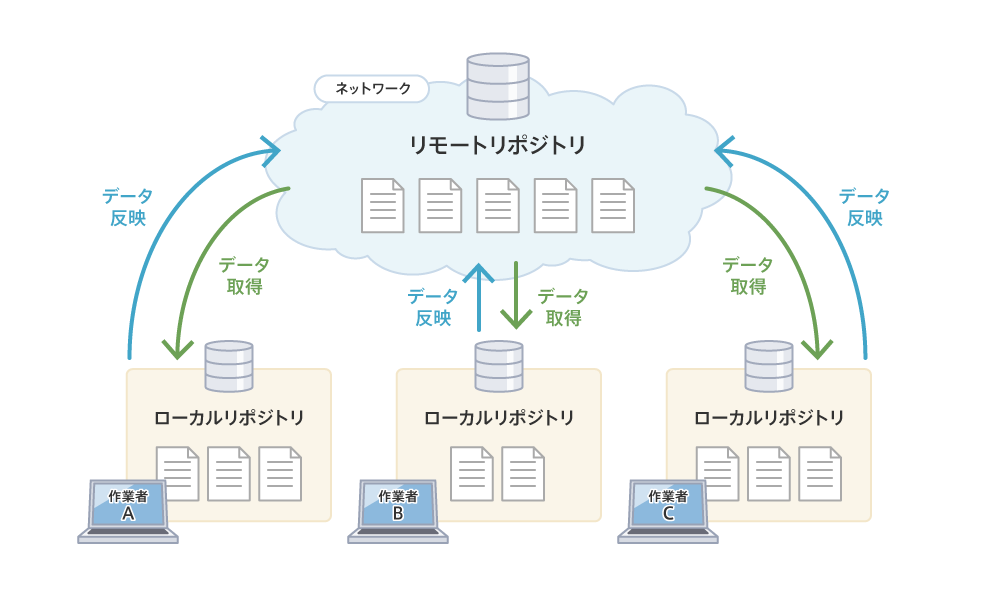
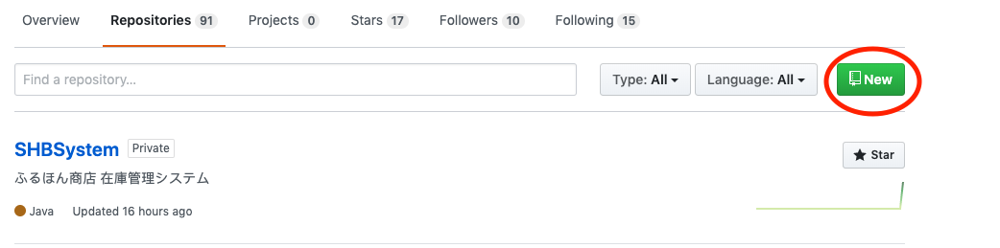
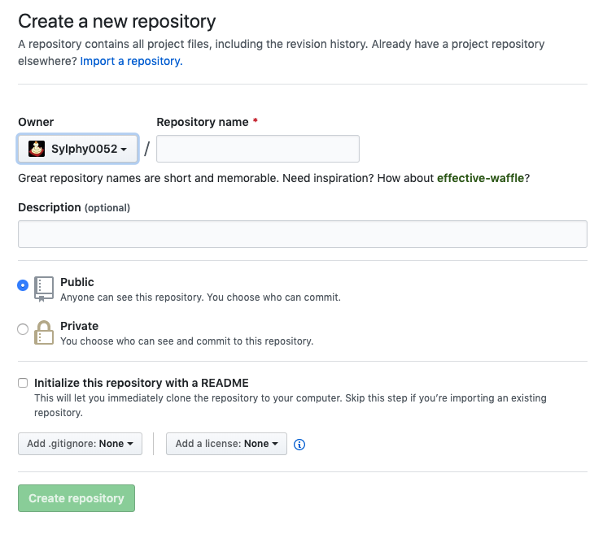
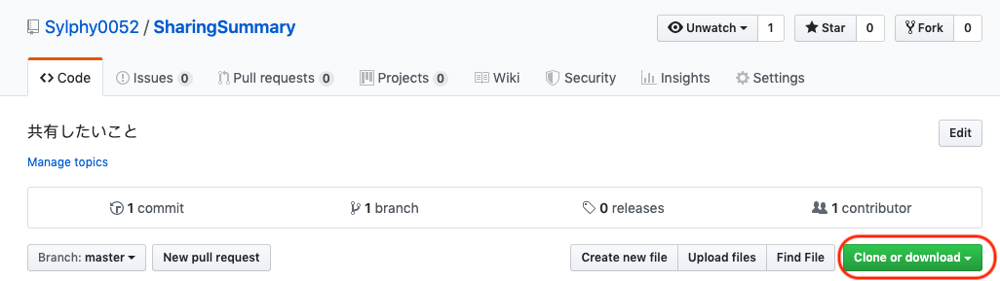

# GitHubとは
GitHub: ソースコード管理システム

主な機能
- ソースコードの閲覧
- 簡単なバグ管理機能
- SNS
- など

## ローカルリポジトリとリモートリポジトリ
リポジトリ: ファイルやディレクトリの状態を保存する場所．
変更履歴を管理したいファイルやディレクトリをリポジトリの管理下に置くことで，そのディレクトリ内のファイルなどの変更履歴を記録できる

リポジトリは自分のPCにある**ローカルリポジトリ**とサーバなどのネットワーク上にある**リモートリポジトリ**が存在する．
開発社はローカルリポジトリで作業を行い，その作業内容をリモートリポジトリへプッシュする．



## コミットとプッシュ
- コミット(commit): ファイルの追加や変更の履歴をローカルリポジトリに保存すること
- プッシュ(push): ファイルの追加や変更の履歴をリモートリポジトリにアップロードするための操作

## ブランチ
ソフトウェアの開発では，現在リリースしているバージョンのメンテナンスをしながら新たな機能追加やバグ修正を行うことがある．
このように，並行して行われる複数のバージョン管理を行うためにGitにはブランチ(branch)という機能がある．

ブランチは履歴の流れを分岐して記録していくものである．
分岐したブランチは他のブランチの影響を受けないため，同じリポジトリ内でそれぞれの開発を行っていくことができる．

## GitHubの流れ(Web(GitHub)とCUI(コマンドプロンプト/ターミナル))

1. [GitHubでリポジトリを作成する](#repository)
2. [リモートリポジトリからローカルリポジトリに持ってくる(clone/クローン)](#clone)
3. ファイルを作成/編集/削除する
4. [ファイルの作成/編集/削除をgitのインデックスに追加する](#add)
5. [変更結果をローカルリポジトリにコミットする](#commit)
6. [ローカルリポジトリでコミットした内容をリモートリポジトリへプッシュする(反映させる)](#push)

<a name="repository">
#### リポジトリの作成


---



- Owner: リポジトリの管理者
- Repository name: リポジトリの名前
- Description(optional): そのリポジトリの名前
- Public/Private: そのリポジトリを公開する(Public)か公開しない(Private)か
- Initialize this repository with a README: [README](#README)をトップページに追加するかどうか
- Add .gitignore: [gitignore](#gitignore)のデフォルト設定
- Add a license: ライセンスを追加するかどうか

<a name="clone">
#### クローン



ここのURLをコピーして使用する

```shell
$ git clone https://github.com/<Owner名>/<リポジトリ名>.git

~/GitHub ❯❯❯ git clone https://github.com/Sylphy0052/SharingSummary.git
Cloning into 'SharingSummary'...
warning: You appear to have cloned an empty repository.
```

<a name="add">
#### ファイルの作成/編集/削除をgitのインデックスに追加する

```shell
# ファイルの状態を表示する
$ git status
# ファイルを追加する
$ git add <ファイル名>
~/G/SharingSummary ❯❯❯ git add README.md
```

<a name="commit">
#### 変更結果をローカルリポジトリにコミットする

```shell
# コミットする
$ git commit -m "<コミットメッセージ>"
```

<a name="push">
#### ローカルリポジトリでコミットした内容をリモートリポジトリへプッシュする(反映させる)

```shell
# originのmasterブランチにプッシュする
$ git push origin master
```

<a name="readme">
## README

<a name="gitignore">
## gitignore

<a name="ref">
## 参考
- [今さら聞けない！GitHubの使い方【超初心者向け】](https://techacademy.jp/magazine/6235)
